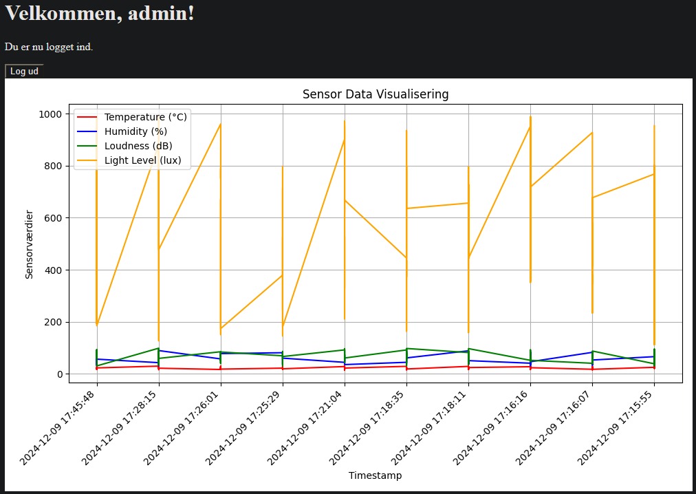

# IOT4 Project - Bottle Website

## Latest WIP screenshot

## Commands

**Create Virtual Environment:**
`python -m venv venv`

**Activate Virtual Environment:**
`.\venv\Scripts\activate`

**Install dependencies:**
`pip install -r requirements.txt`

## Useful VSCode extensions

[Python Inline Source Syntax Highlighting](https://github.com/samwillis/python-inline-source)

## Sources

**Secure login using Bcrypt:**
[GeeksForGeeks: Password Hashing with Bcrypt in Flask](https://www.geeksforgeeks.org/password-hashing-with-bcrypt-in-flask/)

**auth_basic:**
[Stack Overflow: Basic auth authentication in Bottle](https://stackoverflow.com/questions/52461587/basic-auth-authentication-in-bottle),
[Bottle](https://dev.to/storvus/bottle-4e33)

**Database:**
[Python SQLite](https://www.geeksforgeeks.org/python-sqlite/)

**Graph plotting:**
[Efficient Image Processing in Python: A Straightforward Guide to Base64 and Numpy Conversions](https://annacsmedeiros.medium.com/efficient-image-processing-in-python-a-straightforward-guide-to-base64-and-numpy-conversions-e9e3aac13312),
[Matplotlib Pyplot](https://www.w3schools.com/python/matplotlib_pyplot.asp)

**HTTPS/TLS:**
[Bottle Deployment](https://bottlepy.org/docs/dev/deployment.html),
[How to make bottle server HTTPS python](https://stackoverflow.com/questions/44013107/how-to-make-bottle-server-https-python)